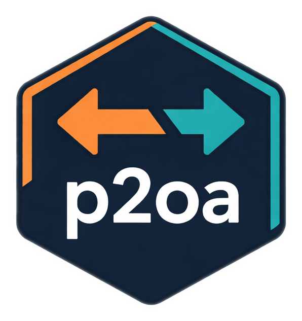

<p align="center">
  
</p>
<h1 align="center">Postman ↔ OpenAPI Converter</h1>
<p align="center">
  A command-line tool for bidirectional conversion between Postman collections and OpenAPI specifications.
</p>

---

# Overview

Modern API development often starts with **Postman collections**, but the broader API ecosystem — documentation systems, gateways, code generators, and CI/CD pipelines — largely revolves around **OpenAPI specifications**.

Postman introduced a **Git integration mode** where collections are stored as a structured YAML directory tree instead of a single exported JSON file. This improves version control and diffability, but it also makes it harder to integrate with the rest of the API tooling ecosystem.

**p2oa** solves that problem.

It acts as a bridge between Postman and OpenAPI workflows, allowing developers to convert collections in either direction and integrate Postman‑based API design into automated pipelines.

---

# Key Features

* Convert **Postman JSON collections → OpenAPI YAML**
* Convert **Postman JSON → Postman Git YAML structure**
* Convert **Postman Git repositories → Postman JSON collections**
* Supports **Postman v2.0 and v2.1** collections
* Generates **OpenAPI 3.1 by default**
* CLI‑friendly for **automation and CI/CD pipelines**

---

# Quick Start

Convert a Postman collection into an OpenAPI specification:

```bash
p2oa to-openapi -i collection.json -o openapi.yaml
```

Pipe the output directly into another tool:

```bash
p2oa to-openapi -i collection.json | openapi-generator generate \
  -g typescript-fetch \
  -i /dev/stdin \
  -o ./client
```

---

# Installation

## Prebuilt Binary

Download the latest executable from the **Releases** page.

```
p2oa.exe
```

Place it somewhere on your system `PATH`.

Example:

```
C:\Tools\p2oa\p2oa.exe
```

---

# Commands

## to-openapi

Convert a **Postman collection JSON → OpenAPI YAML**.

```
p2oa to-openapi -i <collection.json> [-o <output.yaml>] [-v <version>]
```

| Option            | Short | Description                                      |
| ----------------- | ----- | ------------------------------------------------ |
| --input           | -i    | Postman collection JSON file (required)          |
| --output          | -o    | Output file path (default: stdout)               |
| --openapi-version | -v    | OpenAPI version: 3.1 (default), 3.0, 3.2, or 2.0 |

### Examples

Print OpenAPI output to stdout:

```bash
p2oa to-openapi -i collection.json
```

Write OpenAPI to a file:

```bash
p2oa to-openapi -i collection.json -o openapi.yaml
```

Target a specific OpenAPI version:

```bash
p2oa to-openapi -i collection.json -o openapi.yaml -v 2.0
```

---

## to-postman-git

Convert a **Postman JSON export → Postman Git repository format**.

```
p2oa to-postman-git -i <collection.json> -o <output-directory>
```

| Option   | Short | Description                  |
| -------- | ----- | ---------------------------- |
| --input  | -i    | Postman collection JSON file |
| --output | -o    | Output directory             |

### Example

```bash
p2oa to-postman-git -i collection.json -o ./repo
```

Example output structure:

```
repo/
  .postman/
    resources.yaml
  postman/
    globals/
      workspace.globals.yaml
    collections/
      My API/
        .resources/
          definition.yaml
        Users/
          .resources/
            definition.yaml
          List Users.request.yaml
          Get User.request.yaml
          Create User.request.yaml
        Health Check.request.yaml
```

---

## from-postman-git

Convert a **Postman Git YAML repository → Postman JSON collection**.

```
p2oa from-postman-git -i <directory> [-o <output.json>] [-c <collection-name>]
```

| Option       | Short | Description                                   |
| ------------ | ----- | --------------------------------------------- |
| --input      | -i    | Repository root or collection directory       |
| --output     | -o    | Output JSON file (default: stdout)            |
| --collection | -c    | Collection name if multiple collections exist |

### Examples

Auto-detect collection:

```bash
p2oa from-postman-git -i ./repo -o collection.json
```

Convert specific collection:

```bash
p2oa from-postman-git -i ./repo/postman/collections/My\ API -o collection.json
```

---

# Conversion Mapping

## Postman → OpenAPI

| Postman Concept        | OpenAPI Output        |
| ---------------------- | --------------------- |
| Collection name        | info.title            |
| Collection description | info.description      |
| Folder name            | Tag                   |
| {{baseUrl}} variable   | Server URL            |
| :param or {{param}}    | Path parameter        |
| Query parameters       | in: query parameters  |
| Request body           | requestBody           |
| Request description    | Operation description |

### Content-Type Resolution

Content type is determined using the following priority order:

1. Explicit `Content-Type` request header
2. Postman body language option
3. Body content inspection
4. Default fallback: `application/json`

---

# Round‑Trip Conversion

Running:

```
to-postman-git → from-postman-git
```

produces a Postman collection equivalent to the original.

Preserved data includes:

* Collection metadata
* Folder hierarchy
* Request method and URL
* Headers and query parameters
* Request bodies
* Authentication configuration
* Pre-request scripts
* Test scripts
* Item ordering

---

# Examples

The repository includes a working example API.

```
Examples/
  Postman/
    task-manager-api.json
  OpenAPI/
    task-manager-api.yaml
  GIT/
    postman/
```

This example demonstrates:

* folders
* path parameters
* query parameters
* JSON request bodies
* base URL variables

---

# Limitations

Current limitations include:

* Request body schemas are exported as generic `type: object`
* Example responses are not converted into OpenAPI response definitions
* Authentication settings are preserved internally but not yet mapped to OpenAPI `securitySchemes`

These areas may be expanded in future releases.

---

# Building From Source

Requirements:

```
.NET 10 SDK
```

Clone the repository:

```bash
git clone https://github.com/your-username/PostmanToOpenAPI.git
cd PostmanToOpenAPI
```

Run directly:

```bash
dotnet run --project PostmanOpenAPIConverter -- to-openapi -i collection.json
```

Build a standalone executable:

```bash
dotnet publish PostmanOpenAPIConverter \
  -c Release \
  -r win-x64 \
  --self-contained
```

---

# License

MIT License
